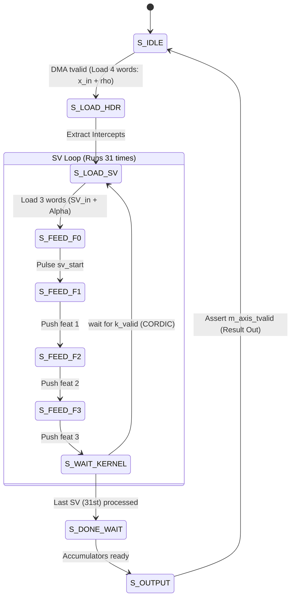

# Comprehensive Presentation Report: Hardware Acceleration of RBF SVM

## 1. Project Objective and Overview
The primary goal of this project is to construct a fully pipelined, fixed-point hardware accelerator for a Support Vector Machine (SVM) utilizing a Radial Basis Function (RBF) kernel. The targeted use-case is classifying the Iris dataset (Setosa, Versicolor, and Virginica) with low latency using a Zynq SoC environment. 

The architecture strictly divides responsibilities:
*   **Software (PS):** Model training, extraction of parameters, quantization (floating-point to fixed-point), and memory mapping the test sequences.
*   **Hardware (PL):** Executing the deterministic, high-throughput datapath involving distance computation, exponentiation, and classification voting.
*   **Communication:** Interfacing uses AXI4-Stream via DMA (MM2S and S2MM channels).

---

## 2. In-Depth Software Implementation

### A. Python Training Pipeline (`train_svm.py`)
The foundation of the project starts with an offline training sequence using `scikit-learn` in Python. Since the FPGA performs inference only, the model's structure and parameters must be frozen and highly optimized.

1. **Data Preprocessing:** The SVM RBF kernel calculates Euclidean distances, making it highly sensitive to unscaled feature ranges. The script utilizes `StandardScaler` to normalize the Iris dataset features to a mean of 0 and a standard deviation of 1.
2. **Model Hyperparameters:** 
    *   `kernel = 'rbf'`
    *   `C = 10.0` (Soft margin penalty parameter)
    *   `gamma = 'scale'` (Calculated dynamically as $1 / (n\_features \times X.var())$, ultimately hardcoded to `0.25` in the fixed-point design for simple arithmetic right shifting).
3. **One-vs-One (OvO) Strategy:** For the 3-class problem, `decision_function_shape='ovo'` instructs the algorithm to train 3 distinct binary classifiers: Class 0 vs 1, Class 0 vs 2, and Class 1 vs 2.
4. **Parameter Extraction:** The script extracts:
    *   **Support Vectors:** The $X$ coordinates defining the boundary (totaling 31 across all classes).
    *   **Dual Coefficients ($\alpha$):** Extracted from `clf.dual_coef_`, these represent the weight each SV carries for a specific classifier.
    *   **Intercepts ($\rho$):** Extracted from `clf.intercept_`, these represent the bias.
5. **C/Verilog Headers:** It autonomously generates `svm_model.h` and `data.h`, formatting the floating-point parameters directly into C arrays so the emulator and Verilog testbenches can parse them easily.

### B. Fixed-Point Quantization
Because floating-point calculations demand exorbitant FPGA resources, the hardware operates purely on fixed-point arithmetic. 
*   **Quantization Scheme (`quantize.c`)**: The entire model (features, support vectors, coefficients, and intercepts) is converted into **Q4.12 representation** (16-bit signed integers). This implies 4 bits for the integer part (including the sign) and 12 bits for the fractional part. 
*   **Software Emulation (`inference_quantized.c`)**: A C-based emulator ensures that the quantizer doesn't cause drastic accuracy drop-offs. The floating-point model achieves 96% accuracy, and the Q4.12 emulator verifies that fixed-point representation preserves this baseline.

---

## 3. AXI-Stream Protocol & Timing Data Flow

Communication between the processor (PS) and the FPGA fabric (PL) uses the AXI4-Stream protocol. To prevent pipeline starvation, a custom `svm_axi_wrapper.v` state machine handles packing/unpacking and orchestrates the handshakes.

### AXI-Stream Memory Map Packing (32-bit width)
Because the features are 16-bit Q4.12, two features are packed per 32-bit DMA beat.

### AXI Wrapper Execution Diagram
The state machine steps through the words, triggers the core execution, and holds for the CORDIC latency.

---

## 4. Hardware Computation Pipelines

### A. Distance Calculator (`dist_calc.v`)
*   **Operation:** Sequentially accumulates the squared Euclidean distance between the 4-dimensional test feature and the current Support Vector. 
*   **Bit-Width Tracking:** Subtracting two Q4.12 values yields a Q5.12 result. Squaring it yields a **Q10.24** result. The accumulator operates at 32 bits (Q8.24) holding the sum of squares cleanly.
*   **Timing:** Latching the 'start' pulse initiates accumulation over exactly 4 clock cycles.

### B. RBF Kernel Scaling & Exponentiation (`kernel.v` & `exp_ip.v`)
*   **Mathematical Scaling:** The hardware computes $-\gamma ||x - x_i||^2$. The $\gamma$ value is set to 0.25. In fixed point, this implies an arithmetic right shift by 2.
*   **Format Conversion:** The distance is natively Q8.24, but the exponentiation IP (`exp_ip`) requires Q4.12. The kernel shifts the distance right by an additional 12 bits (total arithmetic shift right by 14) and applies a 2's complement negation.
*   **Saturation / Convergence Limits:** The CORDIC exponential IP fails to converge correctly for values below roughly $-1.118$. Thus, the `kernel.v` actively clamps any input smaller than `-16'sh1100` to the CORDIC limit `-16'shEE00`, yielding a bounded, safe exponential floor.

### C. Parallel Decision Engines (`svm_decision_engine.v`)
*   **Three Parallel Paths:** Three instances correspond to the OvO pairs. The AXI wrapper demultiplexes the dual coefficients to feed the appropriate engine.
*   **Accumulation with Intercept:** The accumulator (32-bit, Q8.24 format) is initialized at the start of a sample with the negated intercept `-{ {4{intercept[15]}}, intercept, 12'd0 }` (subtracting $\rho$ matches the `scikit-learn` OvO convention).
*   **MAC Operation:** Upon receiving the valid pulse from the `exp_ip`, it multiplies the kernel output (Q4.12) with the dual coefficient (Q4.12), generating a Q8.24 product that is instantly added to the accumulator.

### D. Majority Voting (`svm_top.v`)
Once all 31 SVs are processed, the decision engines raise a `done` flag. Combinational logic checks if the final accumulated scores are positive or negative, allocating "votes" to the respective classes. An `argmax` block resolves the maximum votes and outputs a 2-bit ID (0, 1, or 2).

---

## 5. Latency Breakdown & Debugging Context
The highly pipelined nature dictates a rapid, deterministic execution schedule.
*   **Per Support Vector:** 3 cycles (DMA) + 4 cycles (dist_calc) + ~23 cycles (CORDIC exp) = **~30 cycles**.
*   **Per Sample Total:** 4 cycles (Header) + (31 SVs * 30 cycles) + 2 cycles (Voting/Out) = **~936 cycles**.
*   **Inference Speed:** At a 100MHz clock, inference takes roughly **9.36 microseconds**.

**Debugging the Hardware-Software Parity:**
A crucial phase of this project involved fixing precision mismatches between the C emulator and the Verilog simulation (initially stuck at 40% accuracy). Reaching the 96% target required:
1. **Intercept Alignment:** Correcting the sign logic to ensure the accumulator subtracted the intercept accurately matching the scikit-learn convention.
2. **Bit-Extension Errors:** Fixing sign-extension errors when moving intercepts (Q4.12) directly into the Q8.24 accumulator.
3. **CORDIC Overshoot:** Implementing the saturation logic (`z_to_exp <= 16'shEE00;`) in `kernel.v` to gracefully handle large distances that otherwise wrapped around inside the exponentiation IP.
